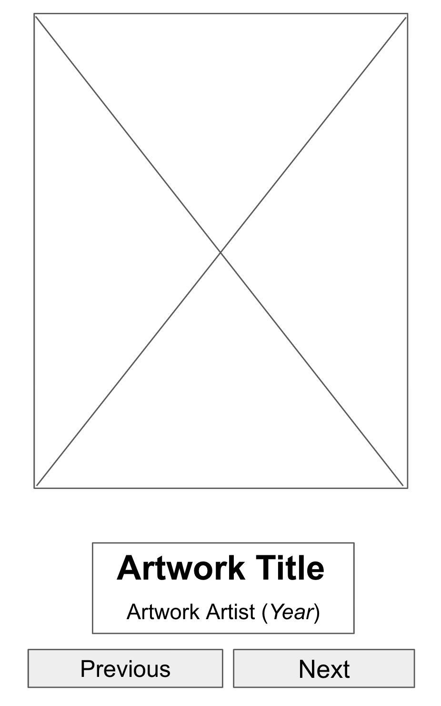
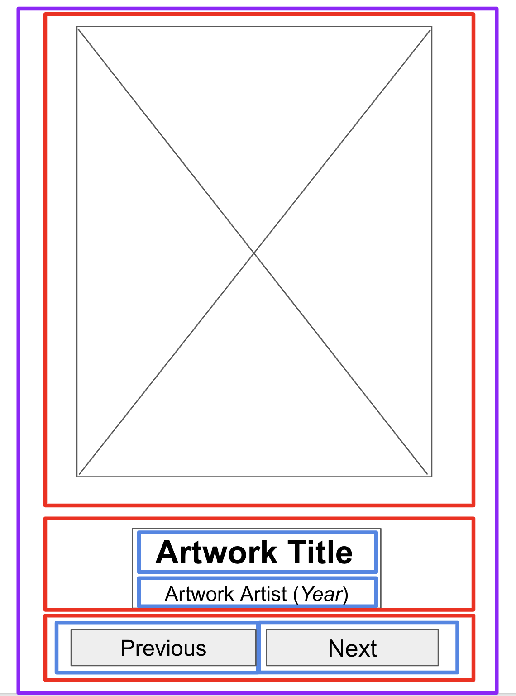
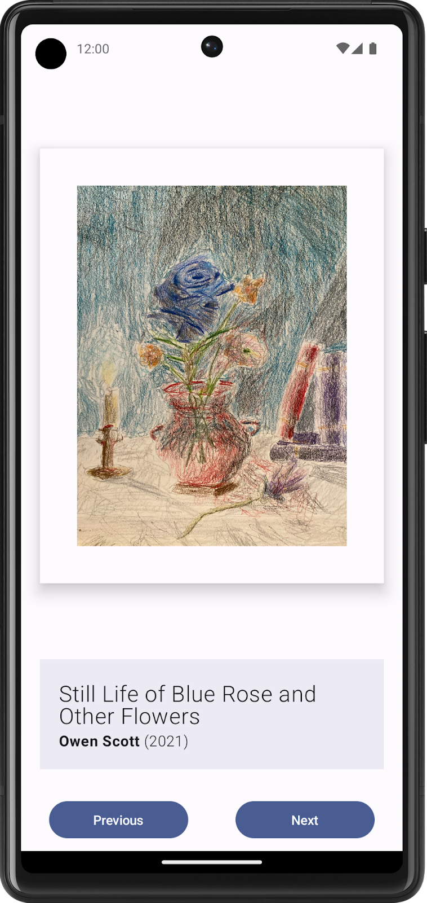

# Lab5：创建 Art Space 应用

## 实验背景

在前面的实验中，你已经掌握了 `Text`、`Image`、`Button`、`Row`、`Column` 等基础 Compose 组件，也学会了用 `remember` 和 `mutableStateOf()` 管理界面状态。本次实验将综合运用这些知识，**独立构建**一款数字艺术空间应用。

与之前提供分步说明的 Codelab 不同，本实验仅提供指南和建议，由你自行决定应用的内容与交互方式。自行构建应用颇具挑战，但你已经进行了足够的练习——不确定某个细节时，可以随时翻阅之前的实验。

> **注意：** 本次图片资源自行寻找，请勿在应用中使用不合适的图片资源。

---

## 前提条件

- 已安装 Android Studio，能够创建并运行 Empty Activity 项目
- 熟悉 Kotlin 基础语法，包括 `Boolean` 和 `when` 表达式
- 了解 Jetpack Compose 中 `@Composable` 函数的基本写法
- 能够使用 `remember` 与 `mutableStateOf()` 保存并更新界面状态
- 已完成前面的 Compose 基础实验

---

## 实验目标

完成本实验后，你应能够：

- 构建低保真度原型并将其转换为代码
- 使用 `Row` 和 `Column` 可组合项构建多区块布局，并合理配置 `horizontalAlignment` 和 `verticalArrangement`
- 使用 `Modifier` 对象自定义组件的样式、间距与尺寸
- 确定哪些界面元素需要状态，并在用户交互时（如点按按钮）正确更新状态
- 使用 `when` 表达式编写多分支条件逻辑

---

## 实验任务

本次实验分为两个部分，必须全部完成。

### 任务一：使用可组合项构建静态界面

#### 第一步：创建低保真度原型

在动手写代码之前，先在纸上或任意工具中画出应用的界面草图。需要考虑的元素包括：

- 艺术作品图片
- 艺术作品相关信息（例如作品名称、艺术家、发表年份）
- 用于切换作品的按钮

参考原型草图如下：



> *图 1. 界面模型中的占位符元素有助于直观呈现最终产品。*

#### 第二步：划分界面区块

找出原型中的逻辑区块，在草图上绘制边界。在本示例中，界面可划分为三个区块：

| 区块 | 包含元素 |
|------|---------|
| 艺术作品墙 | `Image` 组件，展示当前艺术作品 |
| 艺术作品说明 | `Text` 组件，显示作品名称、艺术家、年份 |
| 显示控制器 | `Button` 组件，上一个 / 下一个 |

使用 `Row` 或 `Column` 排列各区块；在区块内部，继续用嵌套布局排列子元素。



> *图 2. 在区块周围绘制边界有助于开发者直观地理解可组合项层次。*

#### 第三步：将设计转换为 Compose 代码

按照划分好的区块，逐步将草图转换为代码。关于各可组合项的使用建议：

- **`Image`：** 务必填写 `contentDescription` 支持无障碍功能；若旁边已有对应文字说明，可将其设为 `null`
- **`Text`：** 尝试 `fontSize`、`textAlign`、`fontWeight` 等参数设置文本样式；可使用 `buildAnnotatedString` 为单个 `Text` 应用多种样式
- **`Surface`：** 可结合 `Modifier.border`、`BorderStroke`、`elevation` 打造带边框的画框效果
- **间距：** 使用 `Spacer`、`padding`、`weight` 等控制元素间距和对齐

#### 第四步：在模拟器或真机上运行

确认静态界面能够正常显示。此时按钮点击还不需要有任何效果。



> *图 3. 此应用显示的是静态内容，用户还无法与其互动。*

---

### 任务二：让应用具有互动性

#### 第一步：确定动态界面元素

思考用户点按 Next / Previous 按钮时，哪些界面元素需要发生变化。在本例中包括：

- 艺术作品图片
- 作品名称
- 艺术家姓名
- 发表年份

#### 第二步：使用 `MutableState` 为动态元素创建状态

```kotlin
var currentArtwork by remember { mutableStateOf(1) }
```

将界面中所有硬编码的图片资源和文字，替换为根据状态动态确定的值。

#### 第三步：先用伪代码梳理逻辑

以三幅艺术作品为例，Next 按钮的逻辑伪代码如下：

```
if (current artwork is the first artwork) {
    // Update states to show the second artwork.
}
else if (current artwork is the second artwork) {
    // Update states to show the third artwork.
}
else if (current artwork is the last artwork) {
    // Update state to show the first artwork.
}
```

#### 第四步：将伪代码转换为 Kotlin 代码

推荐使用 `when` 语句替代 `if-else` 链，提高可读性：

```kotlin
Button(onClick = {
    currentArtwork = when (currentArtwork) {
        1 -> 2
        2 -> 3
        else -> 1
    }
}) {
    Text("Next")
}
```

将切换图片资源和文字的逻辑同步放入 `onClick` 中，或通过状态变量联动更新：

```kotlin
val imageResource = when (currentArtwork) {
    1 -> R.drawable.artwork_1
    2 -> R.drawable.artwork_2
    else -> R.drawable.artwork_3
}
```

#### 第五步：为 Previous 按钮编写对称逻辑

重复以上步骤，实现 Previous 按钮的逻辑（注意边界：在第一幅时跳转到最后一幅）。

#### 第六步：运行并验证

点按 Next / Previous 按钮，确认图片和说明文字能够正确切换。

---

## 代码结构参考

```text
app/
└── src/
    └── main/
        ├── java/com/example/artspace/
        │   └── MainActivity.kt        # 主要 Compose UI 代码
        └── res/
            └── drawable/
                ├── artwork_1.png
                ├── artwork_2.png
                └── artwork_3.png      # 至少准备 3 幅作品图片
```

`MainActivity.kt` 核心结构示例（仅供参考）：

```kotlin
@Composable
fun ArtSpaceApp() {
    var currentArtwork by remember { mutableStateOf(1) }

    val imageResource = when (currentArtwork) {
        1 -> R.drawable.artwork_1
        2 -> R.drawable.artwork_2
        else -> R.drawable.artwork_3
    }

    Column(
        modifier = Modifier.fillMaxSize(),
        horizontalAlignment = Alignment.CenterHorizontally,
        verticalArrangement = Arrangement.SpaceBetween
    ) {
        // 艺术作品墙
        ArtworkWall(imageResource = imageResource)
        // 艺术作品说明
        ArtworkDescriptor(artwork = currentArtwork)
        // 显示控制器
        DisplayController(
            onPrevious = {
                currentArtwork = when (currentArtwork) {
                    1 -> 3
                    else -> currentArtwork - 1
                }
            },
            onNext = {
                currentArtwork = when (currentArtwork) {
                    3 -> 1
                    else -> currentArtwork + 1
                }
            }
        )
    }
}
```

---

## 提示

- 可以用 `Spacer` 组件显式控制元素间距，比直接用 `padding` 更清晰
- `Surface` 配合 `border` 参数可以做出类似画框的视觉效果
- `when` 表达式比长串 `if-else` 更适合处理多幅作品的切换逻辑
- 若将图片名称、作品标题等信息整理成列表或数据类，切换逻辑会更简洁（可在后续单元学习 Collection 和 Data 类后回来重构）
- 截图请使用 Android Studio 内置的截图功能，**严禁使用手机拍屏幕**

---

## 提交要求

在自己的文件夹下新建 `Lab5/` 目录，提交以下文件：

```text
学号姓名/
└── Lab5/
    ├── MainActivity.kt       # 核心源代码（命名规范，结构合理）
    ├── screenshot.png        # 应用运行截图
    └── report.md             # 实验报告
```

`report.md` 需包含：

1. 你的应用展示了哪些内容（主题、作品数量）
2. 界面结构说明（划分了哪些区块，用了哪些可组合项，如何嵌套）
3. 你如何使用 Compose 状态管理当前作品索引
4. Next / Previous 按钮的条件逻辑说明
5. 遇到的问题与解决过程

---

## 验收标准

满足以下条件可视为完成实验：

- 应用可以正常运行，界面无崩溃
- 至少展示 3 幅不同的艺术作品或照片
- 点按 Next / Previous 按钮后，图片和说明文字能够正确切换
- 界面状态由 Compose 状态驱动，而不是写死内容
- 报告中能清晰说明布局结构与状态管理思路

---

## 截止时间

**2026-04-24**，届时关于 Lab5 的 PR 请求将不会被合并。
